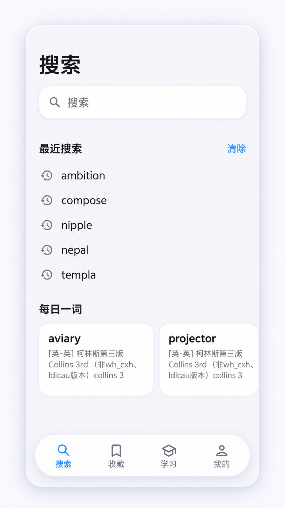
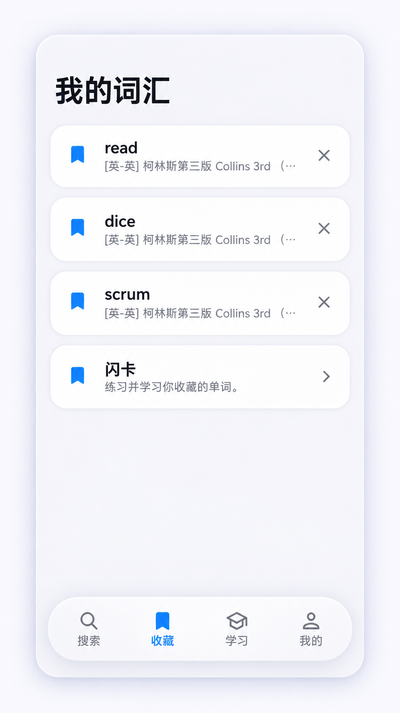
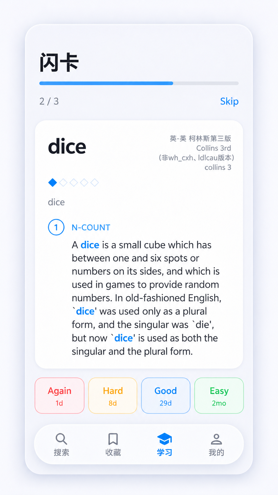
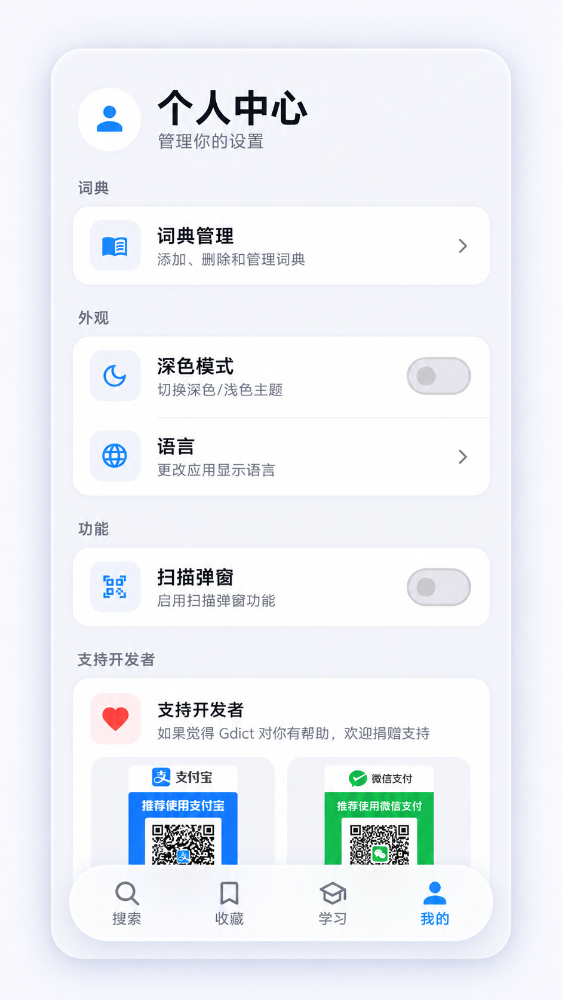
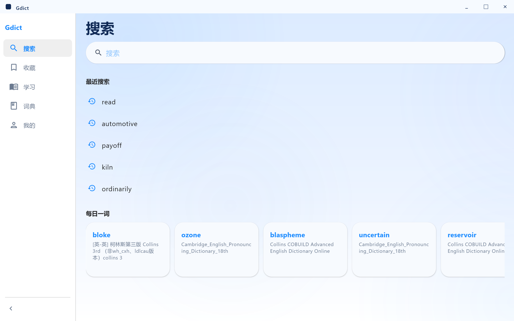
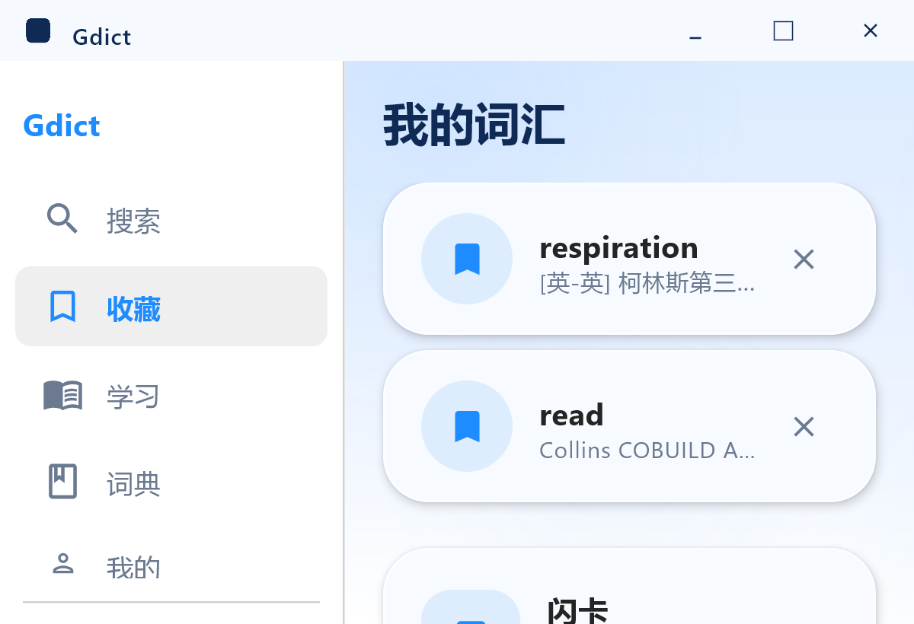
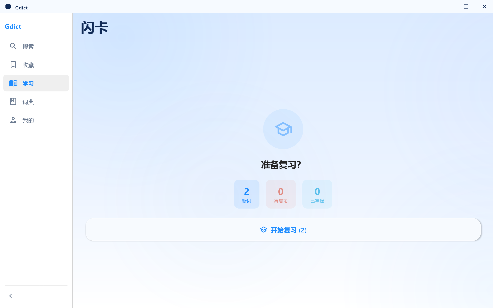
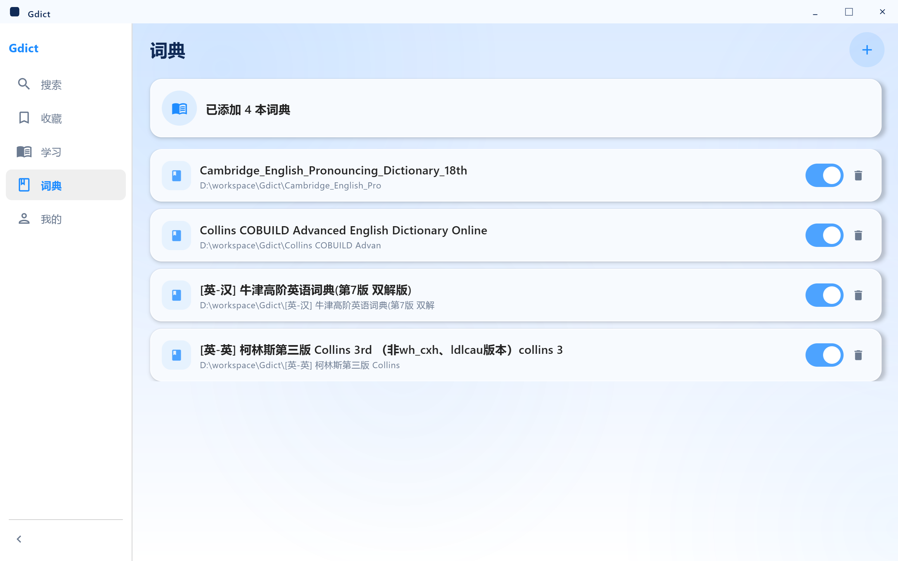
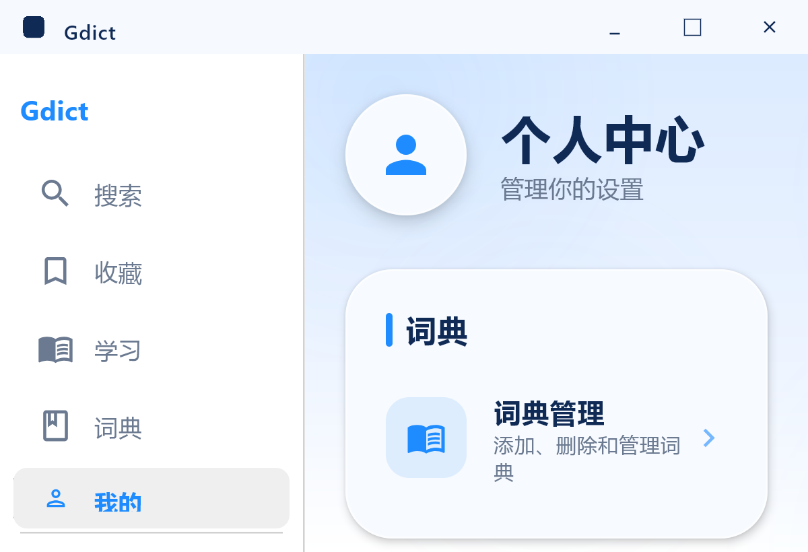

# Gdict

[中文版 (Chinese)](./README.zh-CN.md)

Gdict is a Kotlin dictionary app for Android and desktop. It reads MDX dictionaries, renders their HTML and bundled resources, and includes search, bookmarks, and spaced-repetition review.

## Features

- **MDX/MDD dictionaries** — Parses MDX V1.2 and V2.0, including LZO/zlib compression and RipeMD-128 encrypted headers.
- **Dictionary management** — Import one MDX file or scan a folder; matching MDD and CSS resources can be imported with it. Dictionaries can be enabled, disabled, diagnosed, or removed.
- **Fast lookup** — Exact lookup and prefix suggestions backed by the shared dictionary search engine.
- **Rich definitions** — Renders the original dictionary HTML and resources such as CSS, images, fonts, and audio.
- **Pronunciation** — Uses dictionary audio when available, then an online pronunciation service; Android also falls back to platform text-to-speech.
- **Learning tools** — Search history, word-of-the-day cards, bookmarks, and FSRS flashcard review with Again / Hard / Good / Easy ratings.
- **Localization and themes** — English and Chinese UI strings, plus light/dark themes.
- **Platform UI** — Bottom navigation on Android and a collapsible sidebar on desktop. Desktop uses JCEF to render dictionary content.

## Screenshots

### Android

<div align="center">
  
  
  
  
</div>

### Desktop

<div align="center">
  
  <br><br>
  
  <br><br>
  
  <br><br>
  
  <br><br>
  
</div>

## Technology

| Area | Implementation |
|------|----------------|
| Language | Kotlin 2.1 |
| Android UI | Jetpack Compose + Material 3 |
| Desktop UI | Compose Multiplatform 1.7.3 |
| Shared logic | Kotlin/JVM modules in `shared/` |
| State | ViewModel + StateFlow |
| Android storage | App-private storage with JSON-backed repositories |
| Desktop storage | JSON files under `~/.gdict/` |
| Dictionary HTML | Android WebView / desktop JCEF |
| Build | Gradle Kotlin DSL |

## Project structure

```text
Gdict/
├── shared/
│   ├── core/          # MDX/MDD parsing, importing, search, resources, FSRS
│   └── shared-ui/     # Shared repositories, ViewModels, and TTS abstractions
├── android/           # Android application and platform adapters
├── desktop/           # Compose Desktop application and JCEF integration
├── screenshots/       # README screenshots
├── BUILD.md           # Extended local build notes
└── scripts/           # CI and UI checks
```

## Build and test

Requirements:

- JDK 17
- Android SDK 34 for the Android app
- Android min SDK 26; target/compile SDK 34
- Use the Gradle wrapper in the module you are building

### Android

```bash
cd android

# Debug APK
./gradlew assembleDebug

# Unit tests and Paparazzi screenshot tests
./gradlew testDebugUnitTest

# Release APK; requires android/local.properties signing values
./gradlew assembleRelease
```

The debug APK is written to `android/app/build/outputs/apk/debug/`. See [BUILD.md](./BUILD.md) for SDK and signing setup.

### Shared core tests

```bash
cd shared
./gradlew :core:test
```

To run parser tests against a local dictionary file, add `-Dmdx.file.path=/path/to/dict.mdx`.

### Desktop

```bash
cd desktop

# Run locally
./gradlew run

# Build a Linux AppImage or Windows executable
./gradlew packageAppImage
./gradlew packageExe

# Build the repository's MSIX wrapper task
./gradlew packageMsix

# Compile only
./gradlew :app:compileKotlin
```

Desktop distributables are placed under `desktop/app/build/compose/binaries/`. The packaged Windows build needs the JCEF bundle used by the desktop app; the release workflow downloads it before packaging.

On Windows, use `gradlew.bat` instead of `./gradlew`.

## Using Gdict

1. Import an `.mdx` dictionary from the profile/dictionary-management screen. A same-name `.mdd` file and CSS resources can be included automatically; folder scanning supports batch import.
2. Search for a word to see prefix suggestions, search history, and matching entries from enabled dictionaries.
3. Open an entry to view the original HTML definition and play dictionary or synthesized pronunciation when available.
4. Bookmark entries from the definition page. Review saved words from Favorites or Learning with the FSRS scheduler.
5. Use Profile/Settings to manage dictionaries, switch language or theme, enable scan popup behavior, clear local history and bookmarks, and view diagnostic information.

Imported dictionary files are copied into application-managed storage. The source files are not modified.

## Architecture notes

- `shared/core` contains the MDX parser, streaming resource lookup, dictionary manager/importer, search engine, and FSRS scheduler.
- `shared/shared-ui` contains platform-neutral repository contracts, ViewModels, and shared TTS interfaces.
- `android` supplies Android storage, WebView, audio, locale, and persistence adapters.
- `desktop` supplies JSON-file persistence, JCEF, desktop audio, native packaging, and the desktop sidebar UI.

The shared parser currently requires an MDX primary file. MDD is used for companion resources such as CSS, images, fonts, and audio.

## License

GPL-3.0
