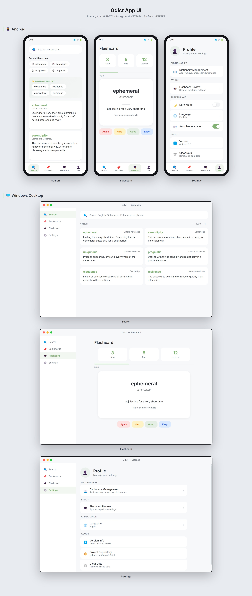

# Gdict

[中文版 (Chinese)](./README.zh-CN.md)

A modern dictionary app for Android & Desktop following Material Design 3, supporting MDX/MDD dictionary formats.

## Features

- **MDX/MDD Parsing** — Supports V1.2 & V2.0 specs, LZO/zlib decompression, RipeMD128 encryption
- **Multi-Dictionary** — Add, remove, enable/disable dictionaries, persistent across restarts, batch folder import
- **Word Search** — Binary search O(log n) exact match + prefix predictive search
- **HTML Rendering** — WebView renders original dictionary HTML, MDD CSS/img/audio resource extraction
- **Pronunciation** — Edge TTS (Microsoft cloud) → MDD audio extraction → local TTS fallback
- **Word of the Day** — Dynamic daily word generation from loaded dictionaries
- **Bookmarks** — Save words, delete with confirmation dialog
- **Search History** — Auto-recorded search history
- **Dark Mode** — System dark mode + in-app toggle
- **Edge-to-Edge** — Immersive status bar and navigation bar
- **MD3 Bottom Nav** — Search / Favorites / Learning / Profile

### Desktop-Specific Features (Compose Multiplatform)

- **JCEF Browser Engine** — Chromium-based rendering for dictionary HTML content with custom scrollbar styling
- **Card Drag & Drop** — Long-press drag to reorder search result cards on Android; click-and-drag on Desktop
- **Pinch to Zoom** — Pinch-to-zoom on search results and word detail pages (Android)
- **SAF File Scanning** — Scan folders for MDX dictionaries using Android Storage Access Framework
- **Soft Brand Color** — PrimarySoft (`#82B274`) for selected states, switches, and interactive elements
- **Custom Scrollbar** — Thin rounded scrollbar with hover effects across all scrollable pages
- **Theme Color** — Green brand color (`#4A7C59`) for sidebar/buttons, neutral gray for main content areas
- **i18n Support** — Full Chinese localization including dialogs, buttons, tooltips, and all UI text
- **Zoom Memory** — Card scale and detail page zoom levels are persisted across sessions
- **Full-Area Click** — Entire word card area is clickable to open detail view
- **Performance** — Browser panel pre-created at startup; image URL preprocessing optimized with regex
- **Afdian Donation** — Support the developer via 爱发电 (Afdian) sponsor page

## Screenshots

<div align="center">
  
</div>

<details>
<summary>More Screenshots</summary>

<div align="center">
  <table>
    <tr>
      <td align="center"><b>Search</b></td>
      <td align="center"><b>Word Detail</b></td>
      <td align="center"><b>Bookmarks</b></td>
      <td align="center"><b>Dictionaries</b></td>
    </tr>
    <tr>
      <td></td>
      <td></td>
      <td></td>
      <td></td>
    </tr>
  </table>

  <table>
    <tr>
      <td align="center"><b>Flashcard</b></td>
      <td align="center"><b>Settings</b></td>
      <td align="center"><b>Dark Mode</b></td>
    </tr>
    <tr>
      <td></td>
      <td></td>
      <td></td>
    </tr>
  </table>
</div>

</details>

## Tech Stack

| Category | Technology |
|------|------|
| Language | Kotlin |
| UI Framework | Jetpack Compose / Compose Multiplatform (Desktop) |
| Design System | Material Design 3 |
| Navigation | Navigation Compose |
| State Management | ViewModel + StateFlow |
| Data Persistence | SharedPreferences (JSON) / JSON File Storage (Desktop) |
| Audio | Edge TTS + MediaPlayer + TextToSpeech |
| Desktop Browser | JCEF (Java Chromium Embedded Framework) |
| Build | Gradle Kotlin DSL |

## Project Structure

```
Gdict/
├── shared/                                 # Shared modules (cross-platform)
│   ├── core/                               # Core library (pure JVM, no platform deps)
│   │   ├── src/main/kotlin/io/github/gdict/core/
│   │   │   ├── MdxParser.kt                # MDX/MDD parser (streaming lookup)
│   │   │   ├── GdictLogger.kt              # Logging interface abstraction
│   │   │   ├── Lzo1xDecompressor.kt        # LZO1X decompressor
│   │   │   ├── RipeMD128.kt                # RipeMD-128 hash
│   │   │   ├── DictionaryManager.kt        # Dictionary manager (coordinator)
│   │   │   ├── DictPersistence.kt          # Dictionary persistence
│   │   │   ├── DictFileImporter.kt         # Dictionary file importer
│   │   │   ├── DictSearchEngine.kt         # Dictionary search engine
│   │   │   ├── FsrsAlgorithm.kt            # FSRS spaced repetition algorithm
│   │   │   └── model/                      # Data models
│   │   │       ├── Dictionary.kt
│   │   │       ├── BookmarkItem.kt
│   │   │       ├── HistoryItem.kt
│   │   │       ├── SearchResultItem.kt
│   │   │       └── ReviewStats.kt
│   │   ├── src/test/kotlin/io/github/gdict/core/
│   │   │   └── MdxParserTest.kt            # Parser unit tests
│   │   └── build.gradle.kts
│   ├── shared-ui/                          # Shared UI logic (ViewModels, Repository interfaces, TTS)
│   │   ├── src/main/kotlin/io/github/gdict/
│   │   │   ├── data/
│   │   │   │   ├── DictionaryRepository.kt # Dictionary repository interface
│   │   │   │   ├── BookmarkRepository.kt   # Bookmark repository interface
│   │   │   │   ├── HistoryRepository.kt    # History repository interface
│   │   │   │   ├── SettingsRepository.kt   # Settings repository interface
│   │   │   │   └── StorageBackend.kt       # Storage backend interface
│   │   │   ├── viewmodel/
│   │   │   │   ├── SearchViewModel.kt      # Search + history + WotD
│   │   │   │   ├── BookmarkViewModel.kt    # Bookmark management
│   │   │   │   ├── FlashcardViewModel.kt   # FSRS flashcard session
│   │   │   │   ├── DictionaryViewModel.kt  # Dict import/management
│   │   │   │   └── SettingsViewModel.kt    # Global settings
│   │   │   └── tts/
│   │   │       ├── EdgeTtsClient.kt        # Microsoft Edge TTS client
│   │   │       └── TtsManager.kt           # TTS manager
│   │   └── build.gradle.kts
│   ├── build.gradle.kts
│   └── settings.gradle.kts
├── android/                                # Android app
│   ├── app/
│   │   ├── src/main/java/io/github/gdict/
│   │   │   ├── MainActivity.kt             # Entry Activity
│   │   │   ├── GdictApplication.kt         # Application (DI setup)
│   │   │   ├── data/                       # Android-specific Repository implementations
│   │   │   │   ├── AndroidDictionaryRepository.kt
│   │   │   │   ├── AndroidBookmarkRepository.kt
│   │   │   │   ├── AndroidHistoryRepository.kt
│   │   │   │   └── AndroidSettingsRepository.kt
│   │   │   ├── platform/                   # Android platform adapters
│   │   │   │   ├── AndroidFileSystemAccess.kt
│   │   │   │   ├── AndroidPersistenceBackend.kt
│   │   │   │   └── AndroidLogger.kt
│   │   │   ├── viewmodel/                  # Android-specific ViewModels
│   │   │   ├── ui/
│   │   │   │   ├── GdictApp.kt             # Main UI + bottom nav
│   │   │   │   ├── screens/                # All screen composables
│   │   │   │   ├── theme/                  # Color, Theme, Typography
│   │   │   │   └── webview/                # WebView, HTML builder, audio, renderers
│   │   │   ├── util/                       # LocaleHelper etc.
│   │   │   └── tts/
│   │   │       └── EdgeTtsClient.kt        # Android Edge TTS client
│   │   ├── build.gradle.kts
│   │   └── proguard-rules.pro
│   ├── build.gradle.kts
│   └── settings.gradle.kts                 # includeBuild("../shared")
├── desktop/                                # Desktop app (Compose Multiplatform)
│   ├── app/
│   │   ├── src/main/kotlin/io/github/gdict/
│   │   │   ├── Main.kt                     # Desktop entry point
│   │   │   ├── core/
│   │   │   │   └── DesktopLogger.kt        # Desktop logger implementation
│   │   │   ├── api/
│   │   │   │   └── AfdianClient.kt         # Afdian donation API client
│   │   │   ├── data/                       # Desktop-specific Repository implementations
│   │   │   │   ├── DesktopDictionaryRepository.kt
│   │   │   │   ├── DesktopBookmarkRepository.kt
│   │   │   │   ├── DesktopHistoryRepository.kt
│   │   │   │   ├── DesktopSettingsRepository.kt
│   │   │   │   └── JsonFileStorageBackend.kt
│   │   │   └── ui/
│   │   │       ├── DesktopApp.kt           # Main desktop UI
│   │   │       ├── LocalStrings.kt         # Localized string provider
│   │   │       ├── components/
│   │   │       │   └── CollapsibleSidebar.kt # Collapsible sidebar component
│   │   │       ├── screens/                # All screen composables
│   │   │       ├── strings/                # i18n string resources (EN/ZH-CN)
│   │   │       ├── webview/                # JCEF, HTML builder, audio, renderers
│   │   │       └── theme/
│   │   │           ├── GdictTheme.kt       # Material theme with green/gray colors
│   │   │           └── GdictColors.kt      # Color definitions
│   │   ├── build.gradle.kts
│   │   └── resources/
│   ├── build.gradle.kts
│   └── settings.gradle.kts                 # includeBuild("../shared")
├── screenshots/
├── mockups/                                # HTML/CSS UI mockups
├── BUILD.md
├── CONTRIBUTING.md
├── CONTRIBUTING.zh-CN.md
├── PRIVACY_POLICY.md
├── README.md
└── README.zh-CN.md
```

## Quick Start

### Prerequisites

- Android Studio Hedgehog (2023.1.1) or later
- JDK 21 (shared/core) / JDK 17+ (Android & Desktop)
- Android SDK API 34
- Gradle 8.5 (included via wrapper)

### Build

#### Android

```bash
cd android

# Debug build
./gradlew assembleDebug

# Release build (requires local.properties configuration)
./gradlew assembleRelease
```

#### Desktop (Compose Multiplatform)

```bash
cd desktop

# Run in development mode
./gradlew run

# Package as distributable app image
./gradlew packageAppImage

# Output location: app/build/compose/binaries/main/app/Gdict/
```

#### MSIX Package (Microsoft Store)

```bash
cd desktop

# Package as MSIX for Microsoft Store submission
./gradlew packageMsix

# Output location: app/build/compose/binaries/main/msix/Gdict.msix
```

Before submitting to the Microsoft Store, update `desktop/msix/AppxManifest.xml` with your Partner Center identity values (`Identity/Name`, `Identity/Publisher`, `PublisherDisplayName`).

### Release Signing

Create `local.properties` under `android/`:

```properties
sdk.dir=D\\:\\path\\to\\android_sdk
storeFile=release.keystore
storePassword=<your_store_password>
keyAlias=gdict
keyPassword=<your_key_password>
```

Note: See [BUILD.md](./BUILD.md) for detailed local build setup instructions.

Generate a keystore:

```bash
keytool -genkeypair -v \
  -keystore release.keystore \
  -alias gdict \
  -keyalg RSA -keysize 2048 -validity 10000
```

### Open in Android Studio

1. Open the `android` directory
2. Wait for Gradle sync
3. Connect a device or start an emulator
4. Click Run

### Run Tests

```bash
cd android

# Run MDX parser unit tests
./gradlew :core:testDebugUnitTest --rerun-tasks

# Run tests with MDX file path
./gradlew :core:testDebugUnitTest -Dmdx.file.path=/path/to/dict.mdx
```

## Usage

### Import Dictionaries

1. Navigate to Settings → Dictionary Management
2. Tap + to select dictionary files
3. Supports `.mdx` files; auto-discovers `.mdd` resources and `.css` styles in the same directory
4. Supports folder-based batch import

### Search

- Type a word in the search bar for real-time suggestions
- Tap a result to view the full definition
- Detail page renders the dictionary's original HTML content

### Pronunciation

- Tap the speaker button on the detail page
- Uses Microsoft Edge TTS (cloud neural voice) as primary engine
- Falls back to MDD audio extraction if offline
- Falls back to local TTS as last resort
- Supports `sound://` custom protocol links in dictionary HTML

### Bookmarks

- Tap the bookmark icon on the detail page to save words
- Manage bookmarks under the Favorites tab
- Delete bookmarks with confirmation dialog

### Flashcard Review (FSRS)

- Uses the FSRS (Free Spaced Repetition Scheduler) algorithm
- Start a review session from the Learning tab or Bookmarks page
- Rate cards as Again / Hard / Good / Easy

### Export Entries (Dev Tool)

`export_words.kt` is a standalone Kotlin script for exporting MDX entries to HTML files:

```bash
kotlinc -script export_words.kt -- /path/to/dict.mdx /path/to/output

# Or via Gradle
cd android
./gradlew export -PmdxPath=/path/to/dict.mdx -PoutputDir=/path/to/output
```

## Core Architecture

### MDX/MDD File Format

MDX file structure:
```
┌──────────────────────────────────────────────┐
│ 1. Header Section   - Dict metadata (XML)     │
│ 2. Keyword Section  - Keyword index + blocks  │
│ 3. Record Section   - Record index + data     │
└──────────────────────────────────────────────┘
```

- V1.2: Integer fields are 4-byte Big-Endian, keyword index is uncompressed
- V2.0: Integer fields are 8-byte Big-Endian (64-bit), keyword index is compressed

Compression block header (8 bytes):
```
[0..3] Compression type (little-endian): 0=none, 1=LZO, 2=zlib
[4..7] Adler32 checksum (big-endian)
[8..]  Actual compressed data
```

MDD files share the same format spec but store resource files (CSS, images, audio, etc.).

### Dictionary Data Isolation

Each imported dictionary is copied to a dedicated directory `filesDir/dictionaries/$id/`, identified by a unique ID and path, ensuring no cross-contamination between dictionaries.

### Search Flow

1. User enters a query
2. ViewModel dispatches to all enabled dictionaries
3. Each MdxParser instance performs an independent binary search
4. Results are aggregated and displayed grouped by dictionary

### Streaming Resource Lookup

For MDD resource files (CSS, images, audio, etc.), a streaming lookup approach is used:

1. Read keyword index blocks directly from file
2. Decompress and search for target resource keys block by block
3. Upon match, read resource data via record offset
4. File pointer is restored after lookup to not interfere with subsequent operations

### WebView Resource Interception

The detail page intercepts resource requests via `WebViewClient.shouldInterceptRequest`:

1. WebView loads dictionary HTML content and requests CSS/images/audio
2. Intercepted requests are served by synchronously reading from the MDD file
3. Returns a `WebResourceResponse` containing the resource data

**Resource Caching**: `DictionaryManager` maintains `resourceCache` and `cssKeysCache` to avoid repeated traversal of MDD keyword indexes. Resource lookup results are cached by path, and CSS key lists are cached by dictionary ID. `SearchViewModel` additionally caches CSS by dictionary name to avoid re-reading from MDD when navigating to the detail page.

**Path Matching**: The interceptor tries multiple path formats for each resource request (backslash, double backslash, filename only, forward slash) and decodes URL-encoded characters (e.g., `%20`), improving MDD resource hit rate. Supported file types include CSS, JS, images, fonts (ttf/woff/woff2), and audio (mp3/wav/ogg/spx).

**Speaker Icons**: Pronunciation icons in dictionaries like Cambridge EPD use CSS `::before` pseudo-elements to render the Unicode ▶ character (U+25B6), replacing unreliable emoji. Speaker-related images (speaker/play/sound/volume etc.) are uniformly replaced with `.speaker-icon` elements. Cambridge-specific CSS is always injected regardless of whether MDD CSS is available.

**Entry Cross-References**: `entry://` links in dictionary HTML (e.g., `entry://bad` in Collins) are intercepted by `shouldOverrideUrlLoading`. The target entry name is extracted and searched asynchronously via `SearchViewModel.searchWordForResult`, then navigated to the detail page with the first matching result's definition.

**WebView Loading Optimization**: HTML content deduplication via `setTag/getTag` prevents redundant `loadDataWithBaseURL` calls; original `<link rel="stylesheet">` tags are removed when CSS is already inlined; `blockNetworkLoads = true` prevents unnecessary network requests.

## Acknowledgments

| Project | Description | Link |
|------|------|------|
| **Linux Kernel** | LZO1X decompression algorithm, ported from `lib/lzo/lzo1x_decompress_safe.c` | [GitHub: torvalds/linux](https://github.com/torvalds/linux) |
| **Jetpack Compose** | Android declarative UI framework | [Android Developers](https://developer.android.com/compose) |
| **Material Design 3** | Google design system | [Material Design 3](https://m3.material.io/) |

## License

GPL-3.0
