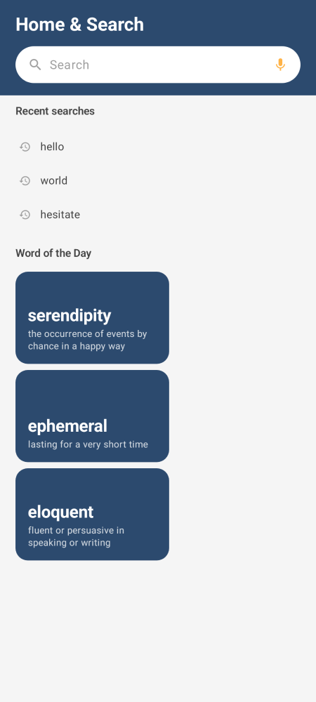
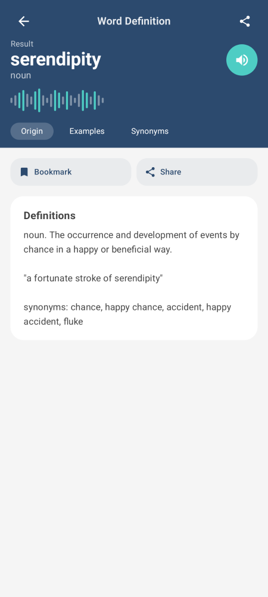
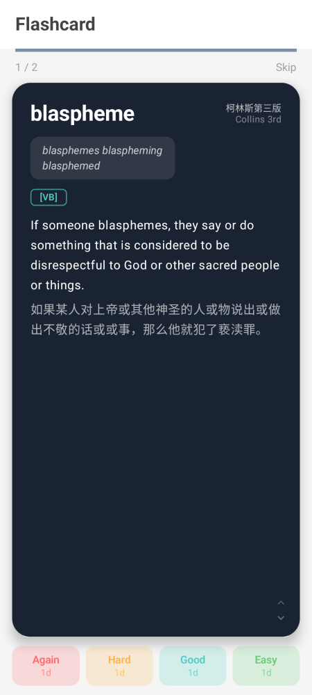
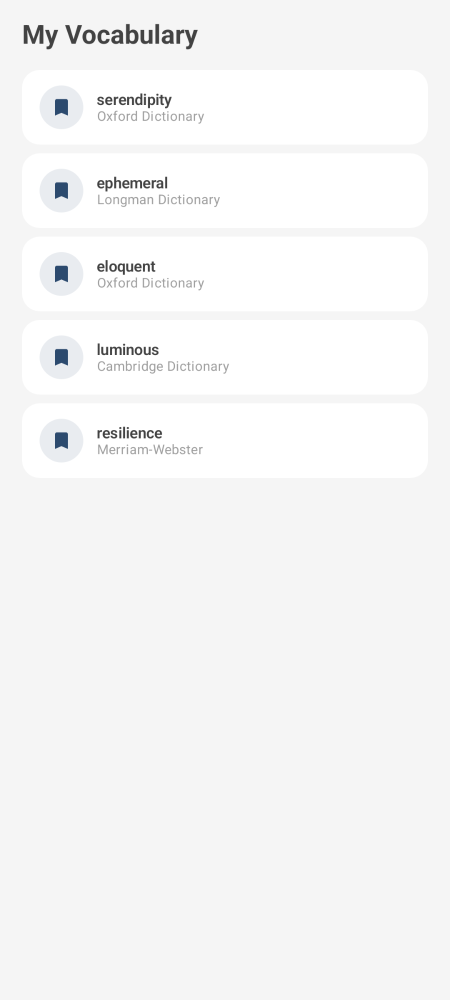
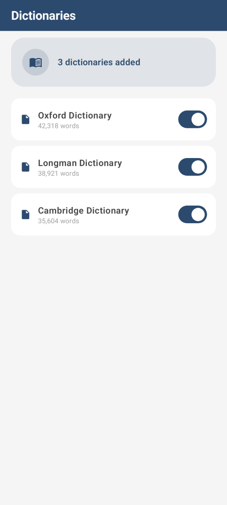
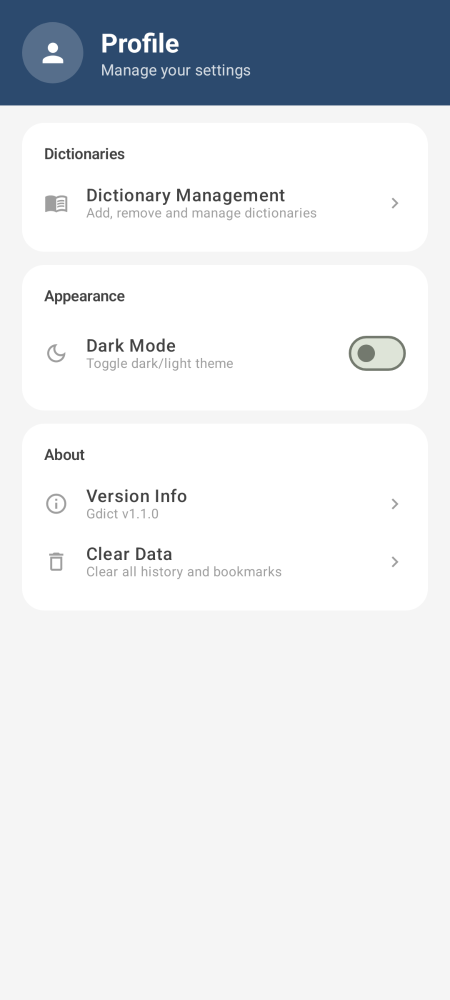

# Gdict

[English](./README.md)

一款遵循 Material Design 3 设计规范的现代 Android 词典应用，支持 MDX/MDD 词典格式，内置 FSRS 间隔重复算法用于单词记忆。

## 目录

- [功能特性](#功能特性)
- [应用截图](#应用截图)
- [技术栈](#技术栈)
- [项目结构](#项目结构)
- [快速开始](#快速开始)
  - [本地开发环境配置](#本地开发环境配置)
  - [构建调试版](#构建调试版)
  - [构建正式版](#构建正式版)
  - [在 Android Studio 中打开](#在-android-studio-中打开)
  - [运行测试](#运行测试)
- [使用教程](#使用教程)
  - [导入词典](#导入词典)
  - [搜索单词](#搜索单词)
  - [发音功能](#发音功能)
  - [生词本与闪卡复习](#生词本与闪卡复习)
  - [词典管理](#词典管理)
  - [深色模式](#深色模式)
  - [导出词条](#导出词条开发工具)
- [核心架构](#核心架构)
  - [MDX/MDD 文件格式详解](#mdxmdd-文件格式详解)
  - [ViewModel 分层设计](#viewmodel-分层设计)
  - [搜索流程](#搜索流程)
  - [FSRS 间隔重复算法](#fsrs-间隔重复算法)
  - [流式资源查找](#流式资源查找)
  - [WebView 资源拦截](#webview-资源拦截)
- [常见问题 (FAQ)](#常见问题-faq)
- [更新日志](#更新日志)
- [本地构建配置](#本地构建配置)
- [致谢](#致谢)
- [许可证](#许可证)

## 功能特性

- **MDX/MDD 词典解析** — 完整支持 V1.2 和 V2.0 规范，含 LZO/zlib 解压、RipeMD128 加密解密
- **多词典管理** — 添加、删除、启用/停用词典，重启后自动恢复，支持文件夹批量扫描导入
- **单词搜索** — 二分查找 O(log n) 精确匹配 + 前缀预测搜索，实时响应
- **HTML 释义渲染** — WebView 渲染词典原始 HTML 内容，从 MDD 提取 CSS/图片/音频资源
- **发音功能** — 微软 Edge TTS 云端发音 → MDD 真人发音提取 → 本地 TTS 兜底
- **Word of the Day** — 从已加载词典中动态生成每日推荐单词
- **生词本** — 收藏单词，支持删除和二次确认对话框
- **闪卡复习 (FSRS)** — 基于 Free Spaced Repetition Scheduler 算法的间隔重复系统
- **搜索历史** — 自动记录搜索历史，支持单项删除和全部清除
- **深色模式** — 应用内一键切换深色/浅色主题
- **Edge-to-Edge 全面屏适配** — 沉浸式状态栏和导航栏
- **Material Design 3** — Search / Favorites / Learning / Profile 四页底部导航

## 应用截图

<div align="center">
  <table>
    <tr>
      <td align="center"><b>搜索首页</b></td>
      <td align="center"><b>单词详情</b></td>
      <td align="center"><b>闪卡正面</b></td>
      <td align="center"><b>闪卡反面</b></td>
    </tr>
    <tr>
      <td></td>
      <td></td>
      <td></td>
      <td></td>
    </tr>
  </table>

  <table>
    <tr>
      <td align="center"><b>生词本</b></td>
      <td align="center"><b>词典管理</b></td>
      <td align="center"><b>设置页</b></td>
      <td align="center"><b>深色模式</b></td>
    </tr>
    <tr>
      <td></td>
      <td></td>
      <td></td>
      <td></td>
    </tr>
  </table>
</div>

> *请将应用截图放置在 `screenshots/` 目录下，替换占位路径为从设备或模拟器截取的实际截图。*

## 技术栈

| 类别 | 技术 | 说明 |
|------|------|------|
| 语言 | Kotlin | 100% Kotlin 代码 |
| UI 框架 | Jetpack Compose | 声明式 UI + Material 3 |
| 设计系统 | Material Design 3 | 动态配色 + 暗色主题 |
| 导航 | Navigation Compose | 类型安全导航 + 参数传递 |
| 状态管理 | ViewModel + StateFlow | 5 个专用 ViewModel 分离关注点 |
| 数据持久化 | SharedPreferences (JSON) | 轻量级数据存储 |
| 音频 | Edge TTS + MediaPlayer + TextToSpeech | 云端 + 本地发音引擎 |
| 构建 | Gradle Kotlin DSL | 模块化构建配置 |

## 项目结构

```
Gdict/
├── android_project/                          # Android 应用（主项目）
│   ├── app/                                  # 应用模块
│   │   ├── src/main/java/io/github/gdict/
│   │   │   ├── MainActivity.kt               # 入口 Activity
│   │   │   ├── GdictApplication.kt           # Application（初始化数据仓库）
│   │   │   ├── data/
│   │   │   │   └── AppRepository.kt          # 数据仓库（单例）
│   │   │   ├── viewmodel/
│   │   │   │   ├── SettingsViewModel.kt      # 全局设置（深色模式等）
│   │   │   │   ├── SearchViewModel.kt        # 搜索 + 历史 + 每日单词
│   │   │   │   ├── BookmarkViewModel.kt      # 收藏管理
│   │   │   │   ├── FlashcardViewModel.kt     # FSRS 闪卡复习会话
│   │   │   │   └── DictionaryViewModel.kt    # 词典导入/管理/诊断
│   │   │   └── ui/
│   │   │       ├── GdictApp.kt               # 主 UI + 导航图 + 底部导航栏
│   │   │       ├── screens/
│   │   │       │   ├── SearchScreen.kt       # 搜索页 + Word of the Day
│   │   │       │   ├── WordDetailScreen.kt   # 词条详情页 + 发音 + WebView
│   │   │       │   ├── BookmarksScreen.kt    # 生词本页
│   │   │       │   ├── FlashcardScreen.kt    # 闪卡复习页 (FSRS)
│   │   │       │   ├── DictionariesScreen.kt # 词典管理页
│   │   │       │   └── SettingsScreen.kt     # 设置页
│   │   │       ├── tts/
│   │   │       │   └── EdgeTtsClient.kt      # 微软 Edge TTS 客户端
│   │   │       └── theme/
│   │   │           ├── Color.kt              # GdictColors 色板
│   │   │           ├── Theme.kt              # GdictTheme + Edge-to-Edge
│   │   │           └── Type.kt               # GdictTypography 字体排版
│   │   ├── build.gradle.kts
│   │   └── proguard-rules.pro
│   ├── core/                                 # 核心库模块（纯逻辑，无 UI 依赖）
│   │   ├── src/main/java/io/github/gdict/core/
│   │   │   ├── MdxParser.kt                  # MDX/MDD 解析器
│   │   │   ├── GdictLogger.kt                # 日志接口抽象
│   │   │   ├── Lzo1xDecompressor.kt          # LZO1X 解压
│   │   │   ├── RipeMD128.kt                  # RipeMD-128 哈希
│   │   │   ├── DictionaryManager.kt          # 词典管理（协调器）
│   │   │   ├── DictPersistence.kt            # 词典持久化
│   │   │   ├── DictFileImporter.kt           # 词典文件导入
│   │   │   ├── DictSearchEngine.kt           # 词典搜索引擎
│   │   │   └── FsrsAlgorithm.kt              # FSRS 间隔重复算法
│   │   ├── src/test/java/io/github/gdict/core/
│   │   │   └── MdxParserTest.kt              # 解析器单元测试
│   │   ├── build.gradle.kts
│   │   └── proguard-rules.pro
│   ├── gradle/wrapper/
│   ├── build.gradle.kts
│   ├── settings.gradle.kts
│   ├── gradle.properties
│   └── export.build.gradle.kts               # 导出任务构建配置
├── export_project/                           # 独立导出工具项目
│   └── build.gradle.kts
├── export_words.kt                           # 独立 MDX 导出脚本
├── BUILD.md                                  # 本地构建配置文档
├── .gitignore
├── README.md                                 # 英文 README
└── README.zh-CN.md                           # 简体中文 README（本文件）
```

## 快速开始

### 本地开发环境配置

详细的本地构建环境配置请参考 [BUILD.md](./BUILD.md)。

核心依赖：
- Android Studio Hedgehog (2023.1.1) 或更高版本
- JDK 17+（项目 `android_sdk/` 已捆绑 JDK 17，开箱即用）
- Android SDK API 34（项目 `android_sdk/` 已包含）
- Gradle 8.5（项目自带 wrapper，无需手动安装）

### 构建调试版

```bash
cd android_project

# 构建 Debug APK
./gradlew assembleDebug

# APK 输出位置
# app/build/outputs/apk/debug/app-debug.apk
```

### 构建正式版

正式版需要签名配置。在 `android_project/` 下创建 `local.properties`：

```properties
sdk.dir=D\\:\\workspace\\Gdict\\android_sdk
storeFile=release.keystore
storePassword=<你的 store 密码>
keyAlias=gdict
keyPassword=<你的 key 密码>
```

生成签名密钥：

```bash
keytool -genkeypair -v \
  -keystore release.keystore \
  -alias gdict \
  -keyalg RSA -keysize 2048 -validity 10000
```

构建：

```bash
cd android_project

# 构建 Release APK
./gradlew assembleRelease

# APK 输出位置
# app/build/outputs/apk/release/app-release.apk
```

### 在 Android Studio 中打开

1. 打开 `android_project` 目录
2. 等待 Gradle 同步完成
3. 连接设备或启动模拟器（最低 API 30）
4. 点击运行按钮

### 运行测试

```bash
cd android_project

# 运行 MDX 解析器单元测试
./gradlew :core:testDebugUnitTest --rerun-tasks

# 指定 MDX 文件路径运行测试
./gradlew :core:testDebugUnitTest -Dmdx.file.path=/path/to/dict.mdx
```

## 使用教程

### 导入词典

1. 点击底部导航栏「Profile」→ 点击「Dictionary Management」
2. 点击右下角 **➕** 浮动按钮
3. 选择以下方式之一：
   - **单个文件**：选择 `.mdx` 文件，应用自动查找同目录下的 `.mdd` 和 `.css` 文件
   - **文件夹批量导入**：选择包含词典的文件夹，扫描并列表候选词典，勾选后批量导入
4. 词典管理页面可随时启用/停用或删除词典

> **提示**：词典文件会拷贝到应用私有目录，原始文件不会被修改或删除。

### 搜索单词

- 在搜索页输入单词，300ms 防抖后自动搜索
- 搜索结果按词典分组展示，显示字典名称和词条预览
- 点击结果进入详情页，展示完整的词典 HTML 释义
- 空搜索框状态显示「搜索历史」和「每日单词推荐」

### 发音功能

- 在词条详情页，点击 🎵 按钮播放单词发音
- **优先**使用微软 Edge TTS 云端神经网络语音（英文 `en-US-AriaNeural` 音色）
- **回退**从 MDD 资源包提取真人发音音频（离线可用）
- **最终回退**到本地 Android TTS 语音合成
- 支持 HTML 中 `sound://` 自定义协议链接

### 生词本与闪卡复习

**收藏单词**：
- 词条详情页点击 🔖 书签图标即可收藏
- 收藏的单词可在「Favorites」页面查看

**闪卡复习 (FSRS)**：
- 在「Favorites」页底部或「Learning」页启动复习
- 基于 FSRS 算法，根据你的评分智能调整复习间隔
- 每次复习显示单词定义，评分选项：
  - **Again** — 完全忘记，短期重新复习
  - **Hard** — 回忆困难，缩短下次间隔
  - **Good** — 正常回忆，按标准间隔复习
  - **Easy** — 轻松回忆，延长下次间隔
- 完成一轮后显示统计：新词 / 待复习 / 已掌握

### 词典管理

- **启用/停用**：停用的词典不会参与搜索
- **删除**：删除词典会同时移除该词典的所有缓存数据
- **诊断**：点击右上角菜单 → Diagnostics，查看所有已加载词典的详细信息
- **扫描导入**：右上角菜单提供扫描导入入口

### 深色模式

- 在「Profile」设置页找到「Dark Mode」开关
- 一键切换深色/浅色主题
- 后续将支持跟随系统深色模式

### 导出词条（开发工具）

`export_words.kt` 是独立的 Kotlin 脚本，可脱离 Android 环境运行，用于批量导出 MDX 词典中的词条到 HTML 文件：

```bash
# 使用 kotlinc 直接运行
kotlinc -script export_words.kt -- /path/to/dict.mdx /path/to/output

# 或通过 Gradle 任务运行
cd android_project
./gradlew export -PmdxPath=/path/to/dict.mdx -PoutputDir=/path/to/output
```

## 核心架构

### MDX/MDD 文件格式详解

MDX 文件是字典数据的标准容器，由三个部分组成：

```
┌──────────────────────────────────────────────────┐
│ Header Section     词典元信息（XML 格式）          │
│   ├─ 编码 (UTF-8/UTF-16/GBK)                     │
│   ├─ 版本号 (V1.2 或 V2.0)                        │
│   ├─ 关键词大小写设置                              │
│   └─ 压缩/加密设置                                │
├──────────────────────────────────────────────────┤
│ Keyword Section    关键词索引 + 关键词块            │
│   ├─ 每个关键词块包含：[关键字长度][关键字][偏移]   │
│   ├─ V1.2: 不压缩，4 字节偏移                      │
│   └─ V2.0: 压缩存储，8 字节偏移                    │
├──────────────────────────────────────────────────┤
│ Record Section     释义记录索引 + 记录数据块        │
│   ├─ 每条记录的压缩头：                             │
│   │   [0..3] 压缩类型 (LE): 0=不压缩, 1=LZO, 2=zlib│
│   │   [4..7] Adler32 校验 (BE)                    │
│   │   [8..]  实际压缩数据                          │
│   └─ 解压后为纯文本 HTML 内容                       │
└──────────────────────────────────────────────────┘
```

**V1.2 vs V2.0 主要区别**：
- V1.2: 整数使用 4 字节 Big-Endian，关键词索引不压缩
- V2.0: 整数使用 8 字节 Big-Endian（64 位），关键词索引经过压缩

**MDD 文件**与 MDX 共享相同格式，但存储资源文件（CSS 样式、图片、音频等），作为词典的「资源包」使用。

**加密机制**：V2.0 支持 RipeMD-128 加密，解析器在读取 Header 后会检查 `Encrypted` 字段，若为 `2` 则使用 RipeMD-128 进行解密。

### ViewModel 分层设计

项目从 v1.1.01 开始，原先臃肿的 `AppViewModel`（321 行）被拆分为 5 个专用 ViewModel：

| ViewModel | 文件 | 职责 |
|-----------|------|------|
| **SettingsViewModel** | `SettingsViewModel.kt` | 全局设置：深色模式开关、扫描弹窗开关、音频资源获取 |
| **SearchViewModel** | `SearchViewModel.kt` | 搜索功能：关键词搜索、搜索历史管理、Word of the Day |
| **BookmarkViewModel** | `BookmarkViewModel.kt` | 收藏管理：添加/移除收藏、收藏列表 |
| **FlashcardViewModel** | `FlashcardViewModel.kt` | 闪卡复习：会话管理、评分、统计 |
| **DictionaryViewModel** | `DictionaryViewModel.kt` | 词典管理：导入、批量导入、删除、启用/停用、诊断 |

各 Screen 的 ViewModel 依赖关系：

```
SearchScreen         → SearchViewModel + SettingsViewModel
WordDetailScreen     → SettingsViewModel (主题 + 音频)
BookmarksScreen      → BookmarkViewModel + SettingsViewModel
FlashcardScreen      → FlashcardViewModel + SettingsViewModel + BookmarkViewModel
DictionariesScreen   → DictionaryViewModel
SettingsScreen       → SettingsViewModel
```

### 搜索流程

1. 用户在搜索框输入查询词 → 300ms 防抖后触发搜索
2. `SearchViewModel` 通过 `AppRepository` 分发到所有启用的词典
3. `DictSearchEngine` 遍历启用词典，对每个 `MdxParser` 实例：
   - 先执行精确二分查找 `readArticles(query)`
   - 若无精确结果，执行前缀预测搜索 `readArticlesPredictive(query)`
4. 结果汇总后按词典分组返回给 UI 层展示

### FSRS 间隔重复算法

Gdict 实现了 [FSRS (Free Spaced Repetition Scheduler)](https://github.com/open-spaced-repetition/fsrs4anki) 算法，包含以下核心概念：

- **Difficulty (难度)**: 1-10 范围，根据评分动态调整
- **Stability (稳定性)**: 记忆牢固程度的度量，决定下次复习间隔
- **Retrievability (可提取性)**: 当前记忆保持的概率 (0-1)
- **meanReversion**: 使用加权均值回归（w=0.4）来平滑难度变化

评分影响：
| 评分 | 难度变化 | 稳定性变化 | 说明 |
|------|----------|-----------|------|
| Again | 增加 (d+a) | 大幅降低 | 完全忘记 |
| Hard | 略微增加 | 惩罚系数 | 回忆困难 |
| Good | 略微降低 | 标准增长 | 正常回忆 |
| Easy | 明显降低 | 奖励系数 | 轻松回忆 |

### 流式资源查找

对于 MDD 资源文件中的 CSS、图片、音频等资源，采用流式查找方式：

1. 直接从文件中读取关键词索引块
2. 逐块解压并搜索目标资源键
3. 找到后通过记录偏移量读取资源数据
4. 查找完成后自动恢复文件指针位置，不影响后续操作

这种设计避免了一次性加载整个 MDD 索引到内存。

### WebView 资源拦截

词条详情页使用 `WebViewClient.shouldInterceptRequest` 拦截资源请求：

1. WebView 加载词典 HTML 内容时，遇到 CSS/图片/音频等资源的引用
2. 拦截器从 MDD 文件同步读取对应资源数据
3. 返回包含资源数据的 `WebResourceResponse`
4. HTML 中的 `sound://` 自定义协议引用也会被拦截并处理为音频播放

**资源缓存**：`DictionaryManager` 维护 `resourceCache` 和 `cssKeysCache`，避免重复遍历 MDD 关键词索引。资源查找结果按路径缓存，CSS 关键词列表按词典 ID 缓存。`SearchViewModel` 额外维护按词典名缓存的 CSS，避免导航到详情页时重复从 MDD 读取。

**路径匹配**：拦截器对每个资源请求尝试多种路径格式（反斜杠、双反斜杠、仅文件名、正斜杠），并对 URL 编码字符（如 `%20`）进行解码，提高 MDD 资源命中率。支持拦截的文件类型包括 CSS、JS、图片、字体（ttf/woff/woff2）和音频（mp3/wav/ogg/spx）。

**发音图标**：Cambridge EPD 等词典的发音图标使用 CSS `::before` 伪元素渲染 Unicode ▶ 字符（U+25B6），替代不可靠的 emoji。发音相关图片（speaker/play/sound/volume 等）统一替换为 `.speaker-icon` 元素。Cambridge 专用 CSS 始终注入，不再受 MDD CSS 是否为空影响。

**交叉引用跳转**：词典 HTML 中的 `entry://` 链接（如 Collins 中的 `entry://bad`）被 `shouldOverrideUrlLoading` 拦截，提取目标词条名后通过 `SearchViewModel.searchWordForResult` 异步搜索，获取第一个匹配结果的 definition 后导航到详情页。

**WebView 加载优化**：通过 `setTag/getTag` 比较 HTML 内容避免重复调用 `loadDataWithBaseURL`；CSS 已内联注入时移除原始 `<link rel="stylesheet">` 标签，避免 WebView 尝试加载外部 CSS；`blockNetworkLoads = true` 阻止不必要的网络请求。

## 常见问题 (FAQ)

### Q: 支持哪些词典格式？

目前支持 `.mdx` + `.mdd` 格式，这是 GoldenDict/Mdict 格式，市面上有大量开源词典资源。

### Q: 如何获取词典文件？

词典文件需要用户自行获取。常见的词典来源包括：
- 开源词典项目（如 [ECDICT](https://github.com/skywind3000/ECDICT)）
- 网络上的 MDX 格式词典资源

### Q: 词典文件会被修改吗？

不会。导入时词典文件被**复制**到应用私有目录，原始文件不会被修改或删除。

### Q: 为什么发音有时候是机器音？

应用优先使用微软 Edge TTS 云端神经网络语音。如果无网络，则回退到 MDD 真人发音；如果词典没有配套 MDD 文件或不包含该单词的音频，最终回退到本地 TTS。

### Q: 闪卡复习中的 FSRS 是什么？

FSRS（Free Spaced Repetition Scheduler）是下一代间隔重复算法，相比 Anki 的 SM-2 算法更加精确。它会根据你的每次评分动态计算最优复习间隔。

### Q: 可以导出收藏的单词吗？

目前该功能还在开发中。你可以通过 `export_words.kt` 脚本导出 MDX 中的全部词条。

## 更新日志

### v1.1.02 (2026-05-25)

- **修复**: Collins COBUILD 等大型词典加载慢、需多次点击的问题 — 新增资源缓存（`resourceCache`）和 CSS Keys 缓存（`cssKeysCache`），WebView 内容去重避免重复加载，`entry://` 链接拦截，URL 解码处理空格等特殊字符，CSS 已内联注入时移除原始 `<link>` 标签
- **修复**: Cambridge EPD 18th 词典发音喇叭图标不显示 — Cambridge 专用 CSS 始终注入（不再受 MDD CSS 是否为空影响），将不可靠的 emoji 替换为 Unicode ▶ 字符，新增 `.speaker-icon` CSS 样式，增强发音相关图片的替换规则
- **新增**: `entry://` 交叉引用跳转 — 点击词典中的交叉引用链接（如 Collins 中的 `entry://bad`），自动搜索目标词条并导航到详情页
- **优化**: SearchViewModel CSS 缓存 — 搜索结果中的 CSS 按词典名缓存，避免导航到详情页时重复从 MDD 读取
- **优化**: WebView 资源拦截增强 — 扩展拦截文件类型（字体、音频），增加多路径格式匹配（反斜杠/正斜杠/仅文件名），URL 解码处理 `%20` 等编码字符，提高 MDD 资源命中率
- **优化**: 卸载词典时不再清空所有词典的资源缓存，避免影响其他正在使用的词典

### v1.1.01 (2026-05-24)

- **重构**: 拆分 AppViewModel 为 5 个专用 ViewModel（SettingsViewModel、SearchViewModel、BookmarkViewModel、FlashcardViewModel、DictionaryViewModel）
- **修复**: FSRS meanReversion 使用独立权重参数（w=0.4）
- **修复**: 移除 RatingButton 中 `days==0` 死代码分支
- **修复**: stripHtml 中 `Regex.replace` 缺少参数导致的编译错误

### v1.1.0

- **新增**: Flashcard 间隔重复复习模块（FSRS 算法）
- **优化**: 词典文件导入与管理逻辑重构

### v1.0.x

- 初版发布：词典解析、搜索、生词本、深色模式等核心功能

## 本地构建配置

详细的本地开发环境搭建指南请参考 [BUILD.md](./BUILD.md)，包括：

- JDK 17+ 安装与 JAVA_HOME 配置
- Android SDK 安装与 sdk.dir 配置
- Gradle 构建命令
- 签名密钥生成
- 常见构建问题排查

## 致谢

| 项目 | 说明 | 链接 |
|------|------|------|
| **Linux Kernel** | LZO1X 解压缩算法，移植自 `lib/lzo/lzo1x_decompress_safe.c` | [torvalds/linux](https://github.com/torvalds/linux) |
| **FSRS** | 间隔重复调度算法 | [open-spaced-repetition](https://github.com/open-spaced-repetition/fsrs4anki) |
| **Jetpack Compose** | Android 声明式 UI 框架 | [Android Developers](https://developer.android.com/compose) |
| **Material Design 3** | Google 设计系统 | [Material Design 3](https://m3.material.io/) |

## 许可证

GPL-3.0
